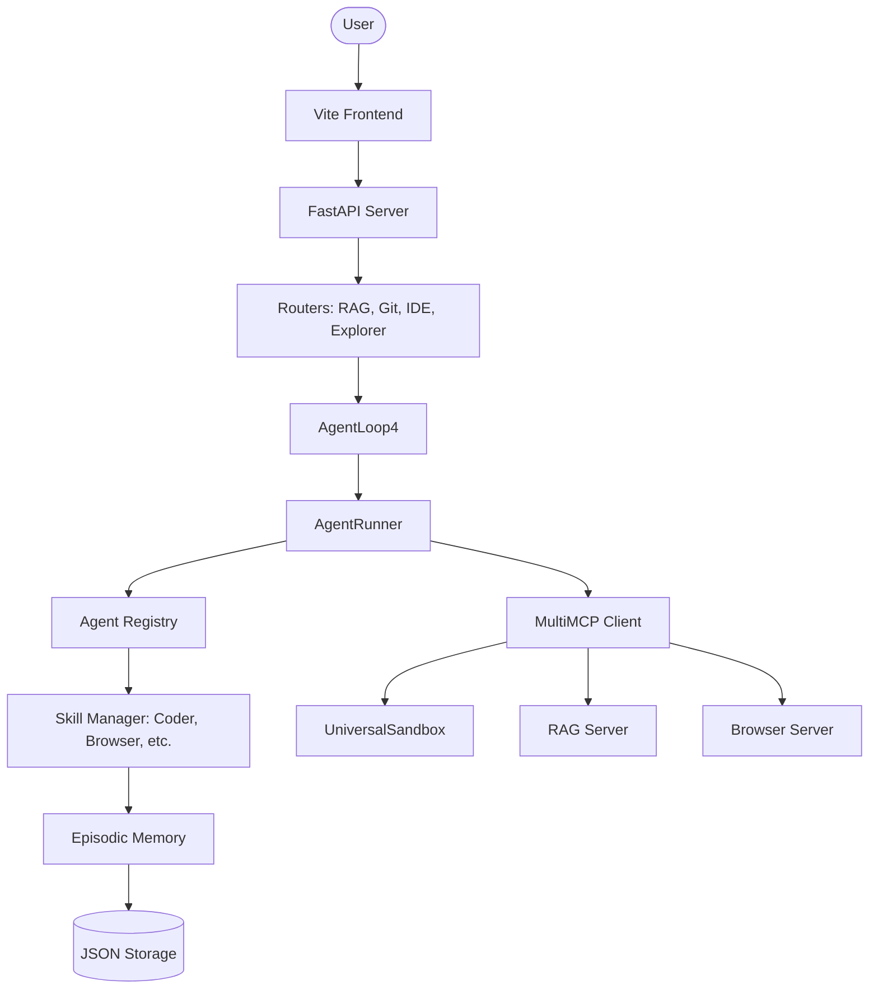

# Arcturus Platform Architecture

Arcturus is a unified agentic OS designed for deep workspace integration and secure execution.

## System Overview

## Key Components

### 1. AgentLoop4 (The Heart)
- Manages the ReAct execution loop.
- Handles retries, token budgets, and step-level state management.
- Integrates with the `UserProfiler` for real-time personalization.

### 2. Universal Sandbox
- Secure execution environment for AI-generated code.
- AST-based safety checks and auto-awaiting for MCP tools.
- Capture/Serialization of real-time logs and results.

### 3. Skill & Agent Registry
- Decentralized skill management (library-based).
- Dynamic prompt compilation based on current agent context.
- Support for "Skills-on-Demand".

### 4. Unified Preview Interface
- Standardized rendering for Code, Markdown, PDF, CSV, and Images.
- Integrated across RAG, Browser, and IDE agents.

### 5. MultiMCP Hub
- High-level client for concurrent interaction with multiple MCP servers.
- Automatic routing and discovery of capabilities.
