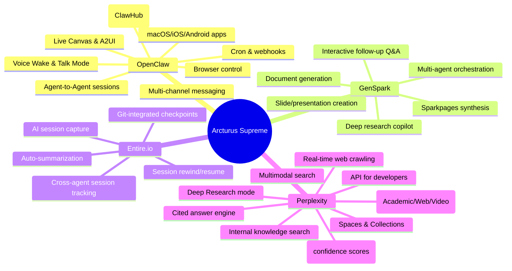
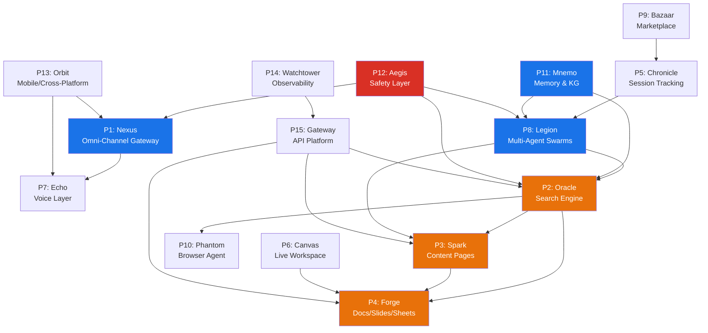

# Project Arcturus: Supreme Overhaul — Unified Agentic Platform

## Executive Vision

Transform Arcturus from a local-first agentic AI assistant into the **definitive unified AI platform** that subsumes and surpasses the capabilities of OpenClaw, GenSpark, Entire.io, and Perplexity. The result: a single platform where users can **search the web with cited answers** (Perplexity), **generate rich synthesized documents and presentations** (GenSpark), **interact through any channel or device** (OpenClaw), and **track every AI session with full reproducibility** (Entire.io) — all powered by Arcturus's existing agentic core, episodic memory, and MCP infrastructure.

**Timeline:** 4 weeks · **Teams:** Multiple cross-functional squads · 

---

## Current State: What Arcturus Does Today

| Layer | Current Capabilities | Key Files/Modules |
|-------|---------------------|-------------------|
| **Agent Core** | Single-threaded agent loop with JitRL reasoning, circuit breaker, persistence | [core/loop.py](file:///Users/rohanshravan/TSAI/Arcturus/core/loop.py), [core/reasoning.py](file:///Users/rohanshravan/TSAI/Arcturus/core/reasoning.py), [core/circuit_breaker.py](file:///Users/rohanshravan/TSAI/Arcturus/core/circuit_breaker.py) |
| **Memory** | Episodic memory with local vector store, JSON persistence | [core/episodic_memory.py](file:///Users/rohanshravan/TSAI/Arcturus/core/episodic_memory.py), [core/persistence.py](file:///Users/rohanshravan/TSAI/Arcturus/core/persistence.py) |
| **MCP Tools** | RAG server (FAISS indexing), browser control, sandboxed execution | [mcp_servers/server_rag.py](file:///Users/rohanshravan/TSAI/Arcturus/mcp_servers/server_rag.py), [server_browser.py](file:///Users/rohanshravan/TSAI/Arcturus/mcp_servers/server_browser.py), [server_sandbox.py](file:///Users/rohanshravan/TSAI/Arcturus/mcp_servers/server_sandbox.py) |
| **Skills** | YAML-defined skill system with scheduling | `core/skills/`, `core/scheduler.py` |
| **Frontend** | React/TypeScript desktop app with IDE agent, chat, apps, news, console, replay, scheduler, skills, settings | `platform-frontend/src/features/` (9 feature modules, 50+ components) |
| **Routers** | 20+ API routers: chat, RAG, git, MCP, apps, news, runs, tests, prompts, IDE agent, explorer, inbox, settings | `routers/` (23 files) |
| **App Generator** | Generates standalone HTML/JS apps from prompts | `apps/` (32+ generated apps) |
| **Model Management** | Multi-model support with query optimization | `core/model_manager.py`, `core/query_optimizer.py` |
| **Metrics** | Aggregated metrics collection | `core/metrics_aggregator.py` |

---

## Competitor Capability Map

---

# The 15 Projects/Teams

---

## PROJECT 1: "Nexus" — Omni-Channel Communication Gateway

> **Inspired by:** OpenClaw (multi-channel inbox, channel routing, group messaging)
> **Team:** Platform Engineering · **Priority:** P0 · **Duration:** 3 weeks

### Objective
Build a unified incoming/outgoing message gateway that lets Arcturus respond through **any channel the user already uses** — WhatsApp, Telegram, Slack, Discord, Microsoft Teams, Signal, iMessage, Matrix, WebChat — from a single agent instance.

### Detailed Features

#### 1.1 Channel Adapters
- **WhatsApp** via Baileys (unofficial WhatsApp Web API) — full message send/receive, media, group support
- **Telegram** via grammY framework — inline keyboards, bot commands, group activation by mention
- **Slack** via Bolt SDK — threaded replies, reactions, file sharing, Slack App manifest
- **Discord** via discord.js — slash commands, embeds, voice channel awareness, role-based gating
- **Microsoft Teams** via Bot Framework SDK — adaptive cards, proactive messaging, Teams-specific threading
- **Signal** via signal-cli — encrypted messaging, group support, disappearing messages compliance
- **iMessage/BlueBubbles** via BlueBubbles REST API — Apple ecosystem bridging, tapback reactions
- **Matrix** via matrix-bot-sdk — federated messaging, end-to-end encryption support
- **Google Chat** via Chat API — spaces, cards, webhooks
- **WebChat** built-in — embeddable widget served from the Arcturus gateway itself

#### 1.2 Unified Message Bus
- Single `MessageEnvelope` schema: `{channel, sender, thread_id, content, media[], metadata}`
- Normalize all inbound messages into the envelope before routing to the agent core
- Outbound: format agent responses per channel (Markdown → Slack mrkdwn, Discord embeds, Teams adaptive cards)
- Media handling: auto-transcode images/video/audio to per-channel optimal formats

#### 1.3 Session & Routing Layer
- **Multi-agent routing:** Route different channels/contacts to isolated agent instances with separate memory contexts
- **Group activation modes:** `mention-only` vs `always-on` per group/channel
- **DM security policy:** Pairing-code flow for unknown senders (allowlist model)
- **Queue modes:** Serial processing vs parallel processing per session
- **Presence & typing indicators:** Real-time status propagation across channels

#### 1.4 Deliverables
- `channels/` directory with adapter modules per platform
- `gateway/router.py` — incoming message router with session affinity
- `gateway/formatter.py` — outbound message formatter per channel
- Config schema: `config/channels.yaml` with per-channel credentials, policies, routing rules
- Integration test suite per channel with mock servers

### Strategy
- Start with WebChat (already partially exists) and Telegram (simplest API) as proof of concept
- Add Telegram, WhatsApp and Slack in week 1
- Discord, Teams, Signal, iMessage in week 2
- Matrix, Google Chat in week 3

---

## PROJECT 2: "Oracle" — AI-Powered Search & Research Engine

> **Inspired by:** Perplexity (answer engine, citations, deep research, real-time web crawling)
> **Team:** AI/Search Engineering · **Priority:** P0 · **Duration:** 4 weeks

### Objective
Build an **answer engine** that, given any query, crawls the web in real-time, synthesizes information from multiple sources, and returns a comprehensive answer **with inline citations** — matching and exceeding Perplexity's capabilities.

### Detailed Features

#### 2.1 Real-Time Web Crawling Pipeline
- **Query decomposition agent:** Break complex queries into 3-8 sub-queries for parallel search
- **Search backends:** Integration with Brave Search API (primary), Bing Web Search API (fallback), Google Custom Search API (fallback)
- **Parallel crawler:** Fetch top 10-20 URLs per sub-query concurrently with 5s timeout
- **Content extraction:** Readability-based article extraction, PDF parsing, table extraction
- **Freshness scoring:** Prefer recent content, time-decay weighting for results
- **Rate limiting & caching:** Semantic cache (Redis) — identical/similar queries reuse cached results within TTL

#### 2.2 Answer Synthesis Engine
- **Multi-source fusion:** Merge extracted content from 20-50 sources into coherent narrative
- **Citation system:** Every claim tagged with `[source_index]` inline, clickable footnotes with URL, title, timestamp, credibility score
- **Confidence scoring:** Per-paragraph confidence level (HIGH/MEDIUM/LOW) based on source agreement
- **Contradiction detection:** Surface conflicting information explicitly: "Source A claims X, while Source B states Y"
- **Anti-hallucination guardrails:** Cross-reference generated claims against source text, flag unsupported statements

#### 2.3 Deep Research Mode
- **Multi-step research:** Agent performs iterative search → read → synthesize → identify gaps → search again (up to 5 iterations)
- **Research plan transparency:** Show the user the search plan before executing, allow modification
- **Progress streaming:** Real-time updates as each source is processed: "Reading article 7/23..."
- **Comprehensive reports:** Output structured reports with executive summary, key findings, methodology, sources

#### 2.4 Focus Modes
- **Academic:** Prioritize Google Scholar, arXiv, PubMed, Semantic Scholar — format citations in APA/MLA/Chicago
- **News:** Prioritize news APIs, recent articles, trending topics — include publication date prominence
- **Video:** Search YouTube, Vimeo — extract transcripts, timestamp-linked summaries
- **Code:** Search GitHub, Stack Overflow, documentation sites — include executable code blocks
- **Finance:** Pull from financial APIs, SEC filings, market data — include charts and data tables
- **Writing:** Focus on creative/editorial assistance — tone adjustments, audience targeting

#### 2.5 Multimodal Search
- **Image search & analysis:** Reverse image search, visual question answering on uploaded images
- **PDF/document analysis:** Upload PDFs, extract content, answer questions about the document
- **Data analysis:** Upload CSV/Excel, auto-generate statistical summaries and visualizations

#### 2.6 Internal Knowledge Search
- **Workspace search:** Search across user's local files, episodic memory, previous conversations
- **Unified results:** Blend web results with internal knowledge, clearly delineating provenance
- **Spaces & Collections:** Let users organize research into persistent spaces for ongoing projects

#### 2.7 Deliverables
- `search/crawl_pipeline.py` — parallel web crawler with content extraction
- `search/query_decomposer.py` — multi-query strategy generator
- `search/synthesizer.py` — multi-source answer fusion with citations
- `search/deep_research.py` — iterative deep research orchestrator
- `search/focus_modes.py` — per-domain search specialization
- `routers/search.py` — API endpoints for search features
- Frontend: `features/search/` — rich search UI with citation sidebar, streaming results, focus mode selector

### Strategy
- Day 1-5: Web crawling pipeline + basic search integration
- Day 6-10: Answer synthesis with citations
- Day 11-15: Deep Research mode
- Day 16-20: Focus modes (Academic, News, Code first)
- Day 21-30: Multimodal search + Internal knowledge search

---

## PROJECT 3: "Spark" — Synthesized Content Pages (Sparkpages)

> **Inspired by:** GenSpark (Sparkpages, multi-agent orchestration, interactive copilot)
> **Team:** AI Content Engineering · **Priority:** P0 · **Duration:** 4 weeks

### Objective
Generate **dynamic, query-specific content pages** (Arcturus Pages) that consolidate and synthesize information into structured, interactive, shareable artifacts — rivaling GenSpark's Sparkpages.

### Detailed Features

#### 3.1 Page Generation Engine
- **Multi-agent page builder:** Orchestrate specialized sub-agents for different page sections:
  - `OverviewAgent` — executive summary and context
  - `DetailAgent` — deep-dive into each key topic
  - `ComparisonAgent` — side-by-side analysis when multiple entities are involved
  - `DataAgent` — extract and present quantitative data, charts, tables
  - `SourceAgent` — curate and validate sources
- **Page template library:** Pre-built templates for common queries:
  - Topic Overview, Product Comparison, How-To Guide, Market Analysis, Research Brief, Person/Company Profile
- **Dynamic section generation:** Auto-determine section structure based on query type and available data

#### 3.2 Interactive Page Features
- **Embedded copilot:** Each page has an inline chat assistant for follow-up questions, drill-downs
- **Live data binding:** Pages can include live widgets (stock ticker, weather, etc.) that update in real-time
- **Section-level refinement:** Click any section to ask the copilot to expand, simplify, add examples, or cite more sources
- **Export formats:** One-click export to PDF, Markdown, HTML, DOCX
- **Sharing:** Generate shareable public URLs with optional password protection

#### 3.3 Page Collections
- **User library:** All generated pages saved and searchable
- **Folders & tags:** Organize pages into folders, apply tags for easy retrieval
- **Version history:** Track page regenerations and edits
- **Collaboration:** Share pages with team members, allow collaborative editing

#### 3.4 Deliverables
- `content/page_generator.py` — multi-agent page orchestrator
- `content/templates/` — page template definitions (YAML + Jinja2)
- `content/section_agents/` — specialized agents for each page section type
- `content/export.py` — multi-format export engine (PDF via WeasyPrint, DOCX via python-docx)
- Frontend: `features/pages/` — rich page renderer with inline copilot, section editing, export controls
- `routers/pages.py` — API for page CRUD, sharing, export

### Strategy
- Start with "Topic Overview" template as MVP, then rapidly add more templates
- Reuse Project 2 (Oracle) search pipeline as the data ingestion layer for pages
- Page rendering in React with component-per-section architecture for maximum flexibility

---

## PROJECT 4: "Forge" — AI Document, Slides & Sheets Studio

> **Inspired by:** GenSpark (AI Slides/Sheets), Skywork AI (slides agent)
> **Team:** AI Content Creation · **Priority:** P0 · **Duration:** 4 weeks

### Objective
Build a full **AI-powered document creation suite** that generates professional presentations, documents, and spreadsheets from natural language prompts — an alternative to Google Workspace + AI.

### Detailed Features

#### 4.1 AI Slides Engine
- **Prompt-to-deck:** "Create a 15-slide pitch deck for a Series A raise for an AI startup" → complete deck
- **Theme system:** 100+ professional themes (Corporate, Creative, Minimal, Dark, Gradient, Academic)
- **Slide types:** Title, Content, Two-Column, Comparison, Timeline, Chart, Image+Text, Quote, Code, Team
- **Content intelligence:**
  - Auto-research: Pull relevant data from web using Project 2 (Oracle)
  - Auto-chart: Generate charts from data (bar, line, pie, funnel, scatter)
  - Auto-image: Generate or source relevant images using image generation API
  - Speaker notes: Auto-generate presenter notes for each slide
- **Edit loop:** Chat-driven editing: "Make slide 3 more visual", "Add a competitor comparison on slide 7"
- **Export:** PPTX (via python-pptx), PDF, HTML (interactive), Google Slides link (via API)
- **Template marketplace:** Users can share and discover slide templates

#### 4.2 AI Document Writer
- **Prompt-to-document:** "Write a technical specification for a microservices migration" → structured doc
- **Document types:** Technical Spec, Business Plan, Research Paper, Blog Post, Legal Brief, Report, Proposal, White Paper
- **Structured outline first:** Generate outline → user approves → fill sections → iterate
- **Citation integration:** Auto-cite sources when research is involved (APA, MLA, Chicago, IEEE)
- **Collaborative editing:** Real-time collaborative editing with AI suggestions inline
- **Version control:** Full document version history with diff visualization
- **Export:** DOCX (via python-docx), PDF (via WeasyPrint), Markdown, LaTeX, Google Docs

#### 4.3 AI Sheets/Data Analysis
- **Prompt-to-spreadsheet:** "Create a financial model for a SaaS startup" → full model with formulas
- **Formula generation:** Natural language → Excel/Sheets formula translation
- **Data analysis agent:** Upload CSV/Excel/JSON → auto-generate:
  - Statistical summaries (mean, median, std, distributions)
  - Correlations and trend analysis
  - Anomaly detection
  - Pivot tables and cross-tabulations
- **Visualization agent:** Auto-generate charts from data with best-fit chart type selection
- **Export:** XLSX (via openpyxl), CSV, Google Sheets (via API)

#### 4.4 Deliverables
- `studio/slides/` — slide generation engine, themes, PPTX export
- `studio/documents/` — document generation engine, templates, multi-format export
- `studio/sheets/` — spreadsheet generation, formula engine, data analysis
- `studio/assets/` — theme CSS, font bundles, chart templates
- Frontend: `features/studio/` — WYSIWYG editor components for slides, docs, and sheets
- `routers/studio.py` — API endpoints for creation, editing, export, sharing

### Strategy
- Begin with slides (highest visual impact) → documents → sheets
- Use separate specialized LLM prompts per content type for optimal quality
- Partner slide themes with the frontend team for pixel-perfect rendering

---

## PROJECT 5: "Chronicle" — AI Session Tracking & Reproducibility

> **Inspired by:** Entire.io (session capture, checkpoints, rewind/resume, git integration)
> **Team:** Developer Tools · **Priority:** P1 · **Duration:** 3 weeks

### Objective
Build a comprehensive **AI session capture system** that records every agent interaction (prompts, responses, tool calls, files modified, reasoning traces) with git-integrated checkpoint/rewind capabilities — enabling full reproducibility and auditability.

### Detailed Features

#### 5.1 Session Capture Engine
- **Auto-capture everything:** Every agent interaction recorded:
  - User prompts (text, files, images)
  - Agent reasoning traces (chain-of-thought, tool selection rationale)
  - Tool invocations (name, args, results, duration)
  - Files created/modified/deleted (full diffs)
  - Model used, token counts, latency metrics
  - Memory reads/writes (episodic memory access log)
- **Session metadata:** Start time, duration, user, agent config, model versions, skill set
- **Low-overhead capture:** Async event streaming to avoid impacting agent latency

#### 5.2 Git-Integrated Checkpoints
- **Automatic checkpointing:** Create checkpoint on each commit or after each agent response (configurable strategy)
- **Checkpoint storage:** Store session data on a separate git branch (`arcturus/sessions/v1`) to keep main branch clean
- **Checkpoint contents:** Full session transcript + file diffs + agent state snapshot
- **Rewind:** `arcturus rewind` — interactive checkpoint selector, restores code and agent state to any checkpoint
- **Resume:** `arcturus resume <branch>` — restore session context and continue where you left off

#### 5.3 Session Explorer UI
- **Timeline view:** Visual timeline of all agent interactions in a session
- **Diff viewer:** Side-by-side file diffs at any checkpoint
- **Replay mode:** Step-through replay of agent reasoning + actions (already exists in `features/replay/`)
- **Search across sessions:** Full-text search across all past sessions
- **Session comparison:** Compare two sessions side-by-side (e.g., before/after a prompt change)

#### 5.4 Auto-Summarization
- **Per-session summaries:** Auto-generate a concise summary of what was accomplished
- **Commit message generation:** Auto-generate meaningful git commit messages from session activity
- **Weekly digest:** Automated weekly report of all AI sessions, changes made, time saved

#### 5.5 CLI Integration
- `arcturus session status` — current session info
- `arcturus session list` — list recent sessions
- `arcturus session rewind [checkpoint-id]` — rewind to checkpoint
- `arcturus session resume <session-id>` — resume a previous session
- `arcturus session export <session-id>` — export session transcript as Markdown

#### 5.6 Deliverables
- `session/capture.py` — async event capture engine
- `session/checkpoint.py` — git-integrated checkpoint manager
- `session/rewind.py` — state restoration engine
- `session/summarizer.py` — auto-summarization agent
- CLI: `scripts/arcturus_session.py` — session management CLI
- Frontend: enhance `features/replay/` with full session explorer, search, comparison

### Strategy
- Leverage existing `features/replay/` UI as foundation
- Build capture engine as middleware in `core/loop.py` — intercept all agent actions
- Use git worktree awareness for concurrent session support

---

## PROJECT 6: "Canvas" — Live Visual Workspace & A2UI

> **Inspired by:** OpenClaw (Live Canvas, Agent-to-UI rendering, A2UI protocol)
> **Team:** Frontend Engineering · **Priority:** P1 · **Duration:** 4 weeks

### Objective
Build a **live, agent-controlled visual workspace** where the AI can render interactive UIs, data visualizations, and rich content directly — moving beyond text-only agent output.

### Detailed Features

#### 6.1 Canvas Runtime
- **A2UI protocol:** Agent can push HTML/CSS/JS bundles to the canvas for immediate rendering
- **Sandboxed rendering:** Canvas content runs in an isolated iframe with controlled permissions
- **Live updates:** Agent can update canvas content in real-time (WebSocket push)
- **Snapshot capture:** Agent can take screenshots of canvas content for its own reasoning

#### 6.2 Built-in Canvas Widgets
- **Data visualization:** Charts (D3.js, Chart.js), tables, heatmaps, network graphs
- **Code editor:** Embedded Monaco editor for live code editing with agent suggestions
- **Whiteboard:** Freeform drawing canvas for brainstorming (Excalidraw-based)
- **Map view:** Geographic data visualization (Leaflet/Mapbox)
- **Image gallery:** Grid/carousel layout for generated or fetched images
- **Kanban board:** Task management visualization
- **Timeline:** Historical/project timeline visualization
- **Form builder:** Dynamic form generation for structured data collection

#### 6.3 Canvas Interactions
- **User → Agent:** User interactions in canvas (clicks, form submits, drawing) sent back to agent as events
- **Agent → Canvas:** Agent can `canvas.push` (full replace), `canvas.update` (partial DOM update), `canvas.eval` (execute JS)
- **Canvas persistence:** Save/load canvas states, share canvas via URL
- **Multi-canvas:** Support multiple simultaneous canvases (e.g., code canvas + visualization canvas)

#### 6.4 Deliverables
- `canvas/runtime.py` — canvas server with A2UI protocol handler
- `canvas/widgets/` — pre-built widget library (React components)
- `canvas/sandbox.py` — iframe sandbox security layer
- Frontend: `features/canvas/` — canvas host component, widget toolkit, interaction handler
- WebSocket: `canvas/ws_handler.py` — real-time canvas update channel

### Strategy
- Start with simple HTML rendering in iframe, then add widget library iteratively
- Integrate with existing `apps/` generator for agent-generated full apps in canvas
- Ensure canvas works in both desktop Electron and web client modes

---

## PROJECT 7: "Echo" — Voice-First Interaction Layer

> **Inspired by:** OpenClaw (Voice Wake, Talk Mode, ElevenLabs integration)
> **Team:** Voice & Audio Engineering · **Priority:** P1 · **Duration:** 4 weeks

### Objective
Add **always-on voice interaction** to Arcturus so users can speak to their agent hands-free, with natural voice responses — making Arcturus usable while driving, cooking, or walking.

### Detailed Features

#### 7.1 Voice Wake (Hotword Detection)
- **Wake word:** Configurable wake phrase (default: "Hey Arcturus")
- **On-device detection:** Use Porcupine (Picovoice) or OpenWakeWord for low-latency, privacy-preserving wake detection
- **Continuous listening:** Background audio monitoring with minimal CPU/battery impact
- **Visual indicator:** Subtle UI indicator showing listening state

#### 7.2 Speech-to-Text (STT)
- **Streaming transcription:** Real-time speech transcription using Whisper (local) or Deepgram (cloud)
- **Multi-language:** Support for 50+ languages with auto-detection
- **Noise robustness:** Noise cancellation preprocessing for real-world environments
- **Punctuation & formatting:** Auto-punctuation and number formatting

#### 7.3 Text-to-Speech (TTS)
- **Natural voice output:** ElevenLabs (primary), Azure Speech (fallback), local TTS (Piper) for offline
- **Voice personas:** Multiple voice styles (professional, casual, energetic) — user configurable
- **Streaming TTS:** Start speaking before full response is generated for low perceived latency
- **SSML support:** Rich speech markup for emphasis, pauses, prosody control

#### 7.4 Talk Mode (Continuous Conversation)
- **Hands-free flow:** Wake → speak → get voice response → continue naturally (no re-wake needed for 30s)
- **Interruption handling:** User can interrupt agent mid-response, agent stops and re-listens
- **Conversation context:** Voice sessions maintain full conversation history like text sessions
- **Background audio:** Optional ambient sound/music while awaiting next command

#### 7.5 Voice Actions
- **Voice-triggered skills:** "Hey Arcturus, check my email" → triggers email skill
- **Voice-controlled navigation:** "Show me the dashboard" → navigate UI
- **Dictation mode:** Long-form speech → document input

#### 7.6 Deliverables
- `voice/wake.py` — hotword detection engine
- `voice/stt.py` — speech-to-text pipeline (streaming)
- `voice/tts.py` — text-to-speech pipeline (streaming)
- `voice/talk_mode.py` — continuous conversation orchestrator
- Frontend: `features/voice/` — voice UI overlay, waveform visualizer, mute/unmute controls
- Mobile/Desktop: mic access, background audio permissions

### Strategy
- Start with browser-based Web Audio API for STT/TTS, then native APIs for desktop/mobile
- Whisper for STT quality, ElevenLabs for TTS quality — both with local fallbacks for privacy mode
- Integrate voice as just another "channel" in Project 1 (Nexus) — voice messages flow through the same pipeline

---

## PROJECT 8: "Legion" — Multi-Agent Swarm Orchestration

> **Inspired by:** GenSpark (multi-agent orchestration), OpenClaw (agent-to-agent sessions), existing scaling plan (Project "Legion")
> **Team:** Core AI Engineering · **Priority:** P0 · **Duration:** 4 weeks

### Objective
Enable **multi-agent collaboration** where a Manager Agent can spawn, coordinate, and aggregate results from multiple Worker Agents — each specialized for different tasks — operating on shared or isolated memory contexts.

### Detailed Features

#### 8.1 Agent Topology
- **Manager-Worker pattern:** 1 Manager routes sub-tasks to N Workers with different specializations
- **Peer-to-Peer pattern:** Agents communicate laterally for consensus/debate before responding
- **Pipeline pattern:** Sequential chain where output of Agent A feeds into Agent B
- **Predefined departments:**
  - Research Department (3 agents: web researcher, academic researcher, data analyst)
  - Engineering Department (3 agents: architect, coder, reviewer)
  - Content Department (3 agents: writer, editor, designer)
  - Business Department (3 agents: strategist, analyst, communicator)

#### 8.2 Agent Communication Protocol
- **Message passing:** Structured `AgentMessage` with `{from_agent, to_agent, task_id, content, artifacts[]}`
- **Shared workspace:** Agents can read/write to shared files and memory spaces
- **Isolated contexts:** Per-agent episodic memory with optional shared knowledge base
- **Progress reporting:** Each agent reports task completion % and intermediate results

#### 8.3 Task Decomposition & Orchestration
- **Intelligent decomposer:** Manager agent analyzes user request and creates a DAG of sub-tasks
- **Dependency resolution:** Tasks execute in correct order based on data dependencies
- **Parallel execution:** Independent tasks execute concurrently, results merged at sync points
- **Failure handling:** If an agent fails, Manager can retry, reassign, or degrade gracefully
- **Budget management:** Total token/cost budget split across agents with priority weighting

#### 8.4 Swarm UI
- **Agent graph visualization:** Real-time DAG showing agents, tasks, data flows, and status
- **Agent chat peek:** View any agent's current conversation/reasoning in a side panel
- **Manual intervention:** User can provide feedback to any agent or redirect the swarm
- **Swarm templates:** Save and reuse successful agent configurations

#### 8.5 Deliverables
- `agents/manager.py` — manager agent with task decomposition
- `agents/worker.py` — generic worker agent with specialization hooks
- `agents/protocol.py` — inter-agent message protocol
- `agents/swarm_runner.py` — swarm lifecycle manager (spawn, monitor, collect)
- `agents/departments/` — pre-built department configurations
- Frontend: `features/swarm/` — swarm visualization, agent peek, intervention controls

### Strategy
- Use Ray.io actor model for agent process isolation and communication
- Start with Manager-Worker for v1, add Peer-to-Peer and Pipeline in v2
- Integrate with Project 5 (Chronicle) — all multi-agent sessions fully captured

---

## PROJECT 9: "Bazaar" — Skills & Agent Marketplace

> **Inspired by:** OpenClaw (ClawHub skills registry), existing scaling plan (Project "Bazaar")
> **Team:** Platform & Ecosystem · **Priority:** P1 · **Duration:** 4 weeks

### Objective
Build an **App Store for AI skills and agents** where users can discover, install, and publish skills — creating a community-driven ecosystem that continuously expands Arcturus's capabilities.

### Detailed Features

#### 9.1 Skills Registry
- **Discovery:** Searchable catalog with categories, ratings, install counts, author profiles
- **Categories:** Productivity, Development, Research, Communication, Finance, Education, Entertainment, Integrations
- **Skill pages:** Each skill has a detail page with description, screenshots, reviews, changelog, permissions required
- **Version management:** Semantic versioning, auto-update with user opt-in
- **Permissions model:** Each skill declares what tools/APIs it needs, user grants permissions on install

#### 9.2 Skill Development Kit (SDK)
- **Skill manifest:** YAML schema defining skill metadata, triggers, tools, prompts
- **Skill template generator:** `arcturus skill create <name>` — scaffold new skill project
- **Local testing:** `arcturus skill test <name>` — run skill in sandboxed environment
- **Documentation generator:** Auto-generate skill docs from manifest and code
- **Publishing flow:** `arcturus skill publish` — validate, package, upload to registry

#### 9.3 Pre-Built Premium Skills
- **Email Manager:** Gmail/Outlook integration — read, compose, schedule, categorize
- **Calendar Agent:** Google/Outlook calendar — scheduling, conflict detection, meeting prep
- **Code Reviewer:** GitHub PR review agent — code analysis, security scanning, style checks
- **Research Assistant:** Deep web research with auto-report generation (uses Project 2)
- **Data Analyst:** Upload data → auto-analysis, visualization, insights (uses Project 4)
- **Social Media Manager:** Twitter/LinkedIn post drafting, scheduling, analytics

#### 9.4 Monetization
- **Free tier:** Community skills with ads-free experience
- **Premium skills:** Creator-set pricing via Stripe Connect
- **Revenue share:** 70/30 split (creator/platform)
- **Subscription bundles:** Monthly subscription for access to all premium skills

#### 9.5 Deliverables
- `marketplace/registry.py` — skill registry API (CRUD, search, reviews, versioning)
- `marketplace/sdk/` — skill development kit (CLI tools, templates, validators)
- `marketplace/install.py` — skill installer with permission management
- `marketplace/billing.py` — Stripe Connect integration for payments
- Frontend: `features/marketplace/` — browse, search, install, publish, review UI
- `routers/marketplace.py` — API endpoints

### Strategy
- Seed marketplace with 20+ first-party skills to establish quality bar
- Existing `core/skills/` directory already has YAML skill definitions — migrate these as the first marketplace entries
- Open-source the SDK to attract community contributors

---

## PROJECT 10: "Phantom" — Autonomous Browser Agent

> **Inspired by:** OpenClaw (browser control, CDP, snapshots), Perplexity (web crawling)
> **Team:** Browser Automation · **Priority:** P1 · **Duration:** 4 weeks

### Objective
Build a **full-featured autonomous browser agent** that can navigate, interact with, and extract information from any website — supporting complex multi-step web tasks.

### Detailed Features

#### 10.1 Browser Control Engine
- **Managed browser:** Arcturus-controlled Chromium instance via Playwright/Puppeteer
- **CDP integration:** Full Chrome DevTools Protocol support for low-level control
- **Multiple profiles:** Isolated browser profiles per task (separate cookies, sessions, storage)
- **Stealth mode:** Anti-detection measures (random user agents, human-like timing, fingerprint randomization)

#### 10.2 Page Understanding
- **DOM snapshot:** Structured representation of page content for agent reasoning
- **Visual snapshot:** Screenshot capture with element annotation (bounding boxes on interactive elements)
- **Accessibility tree:** Parse ARIA labels and semantic structure for reliable element identification
- **Content extraction:** Smart extraction of article text, tables, forms, lists, media

#### 10.3 Action Capabilities
- **Navigation:** URL navigation, back/forward, tab management, multi-window
- **Interaction:** Click, type, select, scroll, drag-and-drop, file upload, form filling
- **Authentication:** Support for login flows, 2FA handling, OAuth consent screens, session persistence
- **Downloads:** File download management with auto-save to workspace
- **Monitoring:** Watch pages for changes, trigger alerts on content updates

#### 10.4 Workflow Automation
- **Multi-step workflows:** Chain browser actions into complex workflows (e.g., "Log into admin panel, export user report, download as CSV, analyze")
- **Conditional logic:** If-then flows based on page content
- **Error recovery:** Retry failed actions, alternate selectors, screenshot-based fallback navigation
- **Recording:** Record user browser actions and convert to replayable automation scripts

#### 10.5 Deliverables
- Enhance `mcp_servers/server_browser.py` with full Playwright integration
- `browser/controller.py` — browser lifecycle and page interaction engine
- `browser/extractor.py` — intelligent content extraction
- `browser/workflow.py` — multi-step workflow sequencer
- `browser/recorder.py` — action recording and script generation
- Frontend: `features/browser/` — browser control panel, live preview, workflow editor

### Strategy
- Existing `server_browser.py` provides foundation — extend with Playwright for reliability
- Integrate browser content extraction as a data source for Project 2 (Oracle search)
- Add browser as a tool available to all agents in Project 8 (Legion)

---

## PROJECT 11: "Mnemo" — Real-Time Memory & Knowledge Graph

> **Inspired by:** Perplexity (Spaces & Collections, internal knowledge), existing scaling plan (Project "Archive")
> **Team:** AI Memory Engineering · **Priority:** P0 · **Duration:** 4 weeks

### Objective
Overhaul Arcturus's memory system from local JSON/FAISS to a **scalable, real-time knowledge graph** with cross-device sync, semantic search, and collaborative knowledge spaces.

### Detailed Features

#### 11.1 Distributed Vector Store
- **Migration from FAISS to Qdrant/Weaviate:** Cloud-hosted vector DB with multi-tenancy
- **Hybrid search:** Combined vector similarity + keyword search + metadata filtering
- **Real-time indexing:** New memories indexed within 100ms of creation
- **Sharding strategy:** Per-user shards with cross-user federated search (for shared spaces)

#### 11.2 Knowledge Graph Layer
- **Entity extraction:** Auto-extract entities (people, companies, concepts, dates) from conversations
- **Relationship mapping:** Build and maintain entity-relationship graph as agent learns
- **Temporal awareness:** Track when facts were learned and whether they've been superseded
- **Graph queries:** Agent can reason over the knowledge graph: "What do I know about X and how does it relate to Y?"
- **Visualization:** Interactive knowledge graph explorer in the frontend

#### 11.3 Spaces & Collections
- **Personal spaces:** Dedicated knowledge areas per project/topic (e.g., "Startup Research", "Home Renovation")
- **Shared spaces:** Team members can contribute to and query shared knowledge spaces
- **Auto-organization:** Agent suggests which space new information belongs to
- **Space templates:** Pre-configured spaces for common use cases (Research Project, Code Repository, Client Management)

#### 11.4 Cross-Device Sync
- **CRDT-based sync:** Conflict-free replication across devices using CRDTs
- **Offline-first:** Full functionality offline, sync when connected
- **Selective sync:** Per-space sync policies (some spaces local-only for privacy)

#### 11.5 Memory Lifecycle
- **Importance scoring:** Auto-score memory importance, promote frequently accessed memories
- **Decay & archival:** Gradually archive low-importance memories (retrievable but not in active search)
- **Contradiction resolution:** When new info conflicts with existing memory, present both and let user/agent resolve
- **Privacy controls:** Per-memory privacy levels, user can mark memories as private/shareable/public

#### 11.6 Deliverables
- `memory/vector_store.py` — Qdrant/Weaviate adapter with hybrid search
- `memory/knowledge_graph.py` — entity extraction + relationship graph (Neo4j or in-memory networkx)
- `memory/spaces.py` — spaces and collections manager
- `memory/sync.py` — CRDT-based cross-device synchronization
- `memory/lifecycle.py` — importance scoring, decay, archival
- Migrate `core/episodic_memory.py` to new system with backward compatibility
- Frontend: `features/memory/` — knowledge graph explorer, spaces manager, memory browser

### Strategy
- Phase 1: Migrate FAISS → Qdrant with feature parity (2 weeks)
- Phase 2: Add knowledge graph layer (3 weeks)
- Phase 3: Spaces & Collections (2 weeks)
- Phase 4: Cross-device sync (3 weeks)
- Maintain backward compatibility with existing `episodic_memory.py` API

---

## PROJECT 12: "Aegis" — Guardrails, Safety & Trust Layer

> **Inspired by:** Perplexity (anti-hallucination, confidence scores, source transparency), OpenClaw (security model, DM pairing), existing scaling plan (Project "Aegis")
> **Team:** Safety & Trust Engineering · **Priority:** P0 · **Duration:** 4 weeks

### Objective
Build a comprehensive **safety and trust layer** that prevents prompt injection, detects hallucination, ensures source accuracy, and manages content policies — making Arcturus enterprise-safe.

### Detailed Features

#### 12.1 Prompt Injection Defense
- **Input scanning:** NeMo Guardrails or Lakera Guard integration for real-time input analysis
- **Instruction hierarchy:** System vs user vs tool prompts with strict privilege boundaries
- **Canary tokens:** Inject trackers to detect prompt leakage
- **Jailbreak detection:** Pattern-matching + ML classifier for known jailbreak patterns
- **Rate limiting:** Per-user and per-session rate limits on sensitive operations

#### 12.2 Anti-Hallucination System
- **Confidence scoring:** Per-claim confidence score (0-1) displayed inline
- **Citation verification:** Auto-verify cited sources actually contain the claimed information
- **Contradiction alerts:** Flag when agent response contradicts its own prior statements or established facts
- **Unsupported claim detection:** Highlight claims that lack source backing
- **Fact-checking pipeline:** Optional post-generation fact-check agent that verifies key claims

#### 12.3 Content Policy Engine
- **Configurable policies:** YAML-defined content policies (no PII exposure, no harmful content, domain-specific rules)
- **Output scanning:** Real-time output scanning against policy before delivery to user
- **PII detection & redaction:** Automatically detect and mask PII in agent outputs
- **Audit logging:** Every policy violation logged with full context for review

#### 12.4 Trust Dashboard
- **Per-response trust score:** Aggregate score based on source quality, confidence, and policy compliance
- **Source transparency:** One-click access to all sources used in generating a response
- **Bias detection:** Flag potential bias in sources or response (using sentiment/perspective analysis)
- **User feedback loop:** Thumbs up/down on responses → feeds back into quality improvement

#### 12.5 Deliverables
- `safety/input_scanner.py` — prompt injection detection middleware
- `safety/hallucination.py` — confidence scoring and claim verification
- `safety/policy_engine.py` — configurable content policy engine
- `safety/pii_detector.py` — PII detection and redaction
- `safety/audit.py` — comprehensive audit logging
- Frontend: `features/safety/` — trust score display, source panel, feedback buttons
- Config: `config/safety_policies.yaml` — default and custom safety policies

### Strategy
- Integrate safety as middleware in `core/loop.py` — intercept both input and output
- Start with prompt injection defense (week 1-2), then anti-hallucination (week 3-4), then content policies (week 5-6)
- Make safety configurable per-user and per-organization for enterprise flexibility

---

## PROJECT 13: "Orbit" — Mobile & Cross-Platform Experience

> **Inspired by:** OpenClaw (iOS/Android nodes, macOS menu bar app), existing scaling plan (Project "Gemini-Mobile")
> **Team:** Mobile Engineering · **Priority:** P1 · **Duration:** 4 weeks

### Objective
Build native **iOS and Android apps** plus a **macOS menu bar companion** that bring the full power of Arcturus to mobile devices with voice-first interaction, push notifications, and device-local capabilities.

### Detailed Features

#### 13.1 Mobile App (React Native / Expo)
- **Chat interface:** Full-featured mobile chat with Markdown rendering, code highlighting, media support
- **Voice mode:** Push-to-talk and continuous listening with Voice Wake (Project 7)
- **Camera integration:** Take photos/scan documents → send to agent for analysis
- **Screen capture:** Share screen recordings with agent for debugging/help
- **Push notifications:** Agent-initiated notifications (task complete, scheduled reminder, alert)
- **Offline mode:** Queue messages when offline, sync on reconnect
- **Widget:** Home screen widget showing latest agent response or quick actions

#### 13.2 macOS Menu Bar App
- **System tray presence:** Always-available quick access to Arcturus
- **Global hotkey:** Cmd+Shift+A → instant agent input overlay
- **Quick actions:** Quick commands without opening full UI (set timer, quick search, clipboard analysis)
- **Status indicator:** Show agent status (idle, thinking, error) in menu bar icon
- **Screen recording:** Agent can request screen recording permission for visual context

#### 13.3 Device Node Protocol
- **Node capabilities:** Each device advertises its capabilities (camera, GPS, files, notifications)
- **Remote control:** Gateway can invoke device capabilities via `node.invoke`
- **Bonjour/mDNS discovery:** Automatic device discovery on local network
- **Secure pairing:** Device pairing via QR code or pairing code

#### 13.4 Cross-Platform Sync
- **Session continuity:** Start conversation on desktop, continue on mobile seamlessly
- **Memory sync:** Shared episodic memory across devices (Project 11 integration)
- **Settings sync:** Preferences, skills, and configurations synced via cloud

#### 13.5 Deliverables
- `mobile/` — React Native (Expo) app with chat, voice, camera, notifications
- `desktop/menubar/` — macOS menu bar app (Electron or Swift)
- `nodes/protocol.py` — device node protocol handler
- `nodes/discovery.py` — Bonjour/mDNS device discovery
- Platform-specific builds: iOS App Store, Google Play Store, macOS DMG

### Strategy
- Start with mobile web (PWA) for immediate cross-platform reach
- Then React Native for native experience (iOS first given user's macOS ecosystem)
- macOS menu bar app as lightweight companion to existing Electron desktop app

---

## PROJECT 14: "Watchtower" — Admin, Observability & Operations Dashboard

> **Inspired by:** OpenClaw (Control UI, Doctor, logging), Perplexity (usage tracking), existing scaling plan (Projects "Watchtower" + "Control")
> **Team:** Operations & DevOps · **Priority:** P1 · **Duration:** 4 weeks

### Objective
Build a comprehensive **admin and observability platform** for monitoring agent performance, user activity, costs, errors, and system health — essential for scaling to 100k users.

### Detailed Features

#### 14.1 Distributed Tracing
- **OpenTelemetry integration:** Instrument all agent operations with traces, spans, and metrics
- **End-to-end request tracing:** See exact path: user message → channel → gateway → agent loop → tool calls → response
- **Latency breakdown:** P50/P90/P99 latencies per operation (LLM call, tool execution, memory lookup)
- **Error correlation:** Automatically link errors to their root causes across services

#### 14.2 Cost Analytics
- **Per-user cost tracking:** Token usage, API calls, compute time per user
- **Per-feature cost breakdown:** Cost per search, per page generation, per session
- **Budget alerts:** Configurable spending thresholds with email/Slack notifications
- **Cost optimization suggestions:** AI-powered recommendations to reduce costs (model switching, caching)

#### 14.3 Health Monitoring
- **Service health dashboard:** Real-time status of all components (agent core, MCP servers, memory, gateway)
- **Uptime tracking:** SLA monitoring with incident timeline
- **Resource usage:** CPU, memory, disk, network usage per component
- **Alert rules:** Configurable alerts (PagerDuty, Slack, email) for anomalies

#### 14.4 Admin Controls
- **User management:** View users, session history, usage stats, ban/suspend capabilities
- **Feature flags:** Toggle features per user/group/globally
- **Cache management:** View and flush semantic caches, memory stores
- **Config management:** Live config updates without restart
- **Diagnostics:** `arcturus doctor` — automated health check and repair suggestions

#### 14.5 Audit & Compliance
- **Action log:** Every state-changing operation logged with actor, action, timestamp, context
- **Data export:** GDPR-compliant data export and deletion
- **Access control:** Role-based access for admin dashboard (SuperAdmin, Admin, Viewer)

#### 14.6 Deliverables
- `ops/tracing.py` — OpenTelemetry instrumentation decorators
- `ops/cost_tracker.py` — per-user, per-feature cost tracking
- `ops/health.py` — service health monitor with alerting
- `ops/admin.py` — user management and feature flag APIs
- `ops/audit.py` — compliance-grade audit logging
- Frontend: `features/admin/` — admin dashboard with grafana-style panels
- `routers/admin.py` — admin API endpoints

### Strategy
- Use OpenTelemetry Python SDK — instrument `core/loop.py`, all routers, MCP servers
- Cost tracking as middleware — intercept all LLM API calls for token counting
- Admin dashboard as a separate authenticated route (not exposed to regular users)

---

## PROJECT 15: "Gateway" — API Platform & Integration Hub

> **Inspired by:** Perplexity (Search API, embeddings API), OpenClaw (webhooks, cron, Gmail Pub/Sub), existing scaling plan (Project "Nexus" AI Gateway)
> **Team:** API & Integration Engineering · **Priority:** P1 · **Duration:** 4 weeks

### Objective
Build a **developer-facing API platform** that exposes Arcturus's capabilities as APIs and provides a rich integration framework with webhooks, cron jobs, and third-party service connectors.

### Detailed Features

#### 15.1 Public API
- **Search API:** `/api/v1/search` — real-time web search with citations (uses Project 2)
- **Page Generation API:** `/api/v1/pages/generate` — generate Arcturus Pages programmatically
- **Document API:** `/api/v1/studio/{slides|docs|sheets}` — generate documents via API
- **Chat API:** `/api/v1/chat/completions` — OpenAI-compatible chat API backed by Arcturus agent
- **Embeddings API:** `/api/v1/embeddings` — generate embeddings for text using Arcturus's models
- **Memory API:** `/api/v1/memory/{read|write|search}` — programmatic access to knowledge spaces
- **Agent API:** `/api/v1/agents/run` — spawn an agent task and get results

#### 15.2 API Management
- **API keys:** Self-service API key generation with per-key rate limits and permissions
- **Rate limiting:** Token bucket algorithm with burst handling
- **Usage metering:** Per-key usage tracking with monthly billing
- **API documentation:** Auto-generated OpenAPI/Swagger docs + interactive playground
- **SDKs:** Official Python and TypeScript SDKs

#### 15.3 Webhooks & Events
- **Outbound webhooks:** Subscribe to agent events (task complete, error, memory update) and receive HTTP POST notifications
- **Inbound webhooks:** Trigger agent actions via incoming webhooks
- **Event types:** `agent.response`, `task.complete`, `task.error`, `memory.updated`, `session.started`, `session.ended`
- **Retry policy:** Exponential backoff with dead letter queue for failed deliveries

#### 15.4 Cron & Scheduled Tasks
- **Cron jobs:** Define recurring agent tasks: "Every Monday at 9am, generate weekly project summary"
- **Calendar integration:** Trigger tasks based on calendar events
- **One-off scheduling:** "In 2 hours, remind me to check the deployment"
- **Cron UI:** Visual cron job editor with natural language support

#### 15.5 Third-Party Integrations
- **Gmail Pub/Sub:** Real-time email notifications → agent processing
- **GitHub:** PR events, issue tracking, code review automation
- **Jira:** Ticket creation/updates from agent, project tracking integration
- **Notion:** Page creation/updates, database queries
- **Google Drive:** File access, document import/export
- **Salesforce:** CRM data access, record management
- **Zapier/Make:** Generic integration layer via webhooks for 1000+ apps

#### 15.6 MCP Server Registry
- **Remote MCP servers:** Connect to cloud-hosted MCP servers (Salesforce MCP, Notion MCP, etc.)
- **MCP discovery:** Directory of available MCP servers with auto-configuration
- **Custom MCP servers:** Documentation and toolkit for building custom MCP servers
- **SSE transport:** Server-Sent Events transport layer for remote MCP connections

#### 15.7 Deliverables
- `api/v1/` — versioned API endpoint handlers
- `api/auth.py` — API key management and authentication
- `api/rate_limiter.py` — token bucket rate limiter
- `api/metering.py` — usage metering and billing
- `api/webhooks.py` — webhook subscription and delivery engine
- `api/cron.py` — cron job scheduler (enhance existing `core/scheduler.py`)
- `integrations/` — third-party service adapters (Gmail, GitHub, Jira, etc.)
- `api/sdks/` — Python and TypeScript SDK packages
- Frontend: `features/api/` — API key management, webhook config, cron editor, docs browser

### Strategy
- Design API to be OpenAI-compatible where possible for ecosystem compatibility
- Existing `routers/` provide the foundation — wrap with API key auth and rate limiting
- Existing `core/scheduler.py` and `routers/cron.py` provide cron foundation — extend with persistent storage and UI

---

## Cross-Project Dependency Map

---

## Execution Timeline (4 Weeks)

| Week | Projects | Milestones |
|-------|----------|-----------|
| **W1** | P2 (Oracle), P11 (Mnemo), P12 (Aegis) | Core search working, memory migration, safety middleware |
| **W1** | P1 (Nexus), P3 (Spark), P5 (Chronicle) | 3+ channels live, first Sparkpages, session capture |
| **W2** | P4 (Forge), P8 (Legion), P10 (Phantom) | Slides MVP, 2-agent swarms, browser agent v1 |
| **W2** | P6 (Canvas), P7 (Echo), P9 (Bazaar) | Canvas rendering, voice mode, marketplace beta |
| **W3** | P13 (Orbit), P14 (Watchtower), P15 (Gateway) | Mobile app beta, observability live, API v1 |
| **W4** | Integration, polish, security audit, load testing | Public beta, 100k-user capacity verified |

---

## Team Allocation Recommendation

| Team | Projects | Headcount |
|------|----------|-----------|
| **Core AI** | P2, P8, P11 | 5 engineers |
| **Content & Creative AI** | P3, P4 | 4 engineers |
| **Platform Engineering** | P1, P15 | 4 engineers |
| **Frontend** | P6, P3 (UI), P4 (UI), P14 (UI) | 4 engineers |
| **Mobile** | P13, P7 | 3 engineers |
| **DevTools** | P5, P10 | 3 engineers |
| **Safety & Ops** | P12, P14 | 2 engineers |
| **Ecosystem** | P9 | 2 engineers |

---

## Success Metrics

| Metric | Target (4 Weeks) |
|--------|-------------------
| Cited answer accuracy | > 90% |
| Slide/doc export success rate | > 95% |
| Voice recognition accuracy | > 95% |
| Session capture completeness | 100% |
| API uptime | > 99.9% |
| P95 search latency | < 3 seconds |
| Active channels supported | 10+ |
| Marketplace skills available | 50+ at launch |
